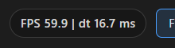
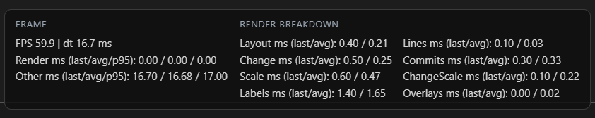

# Timeline Profiler Overlay

This overlay reports frame timing and a breakdown of the work performed during each redraw of the timeline view. The numbers come from lightweight timers and Pixi's ticker values; they are intended for development diagnostics, not production-grade profiling.

## Enable Or Disable

Open the Timeline controls in the left sidebar Tweakpane:
- **PixiJS Performance Monitor**: toggles the FPS/dt pill in the header.
- **PixiJS Profiler Overlay**: toggles the multi-column overlay at the top center.

Both toggles are only visible in Timeline mode.

## Screenshots

## What Each Value Measures

### Frame
- **FPS**: Read from `app.ticker.FPS`. This is Pixi's smoothed frames-per-second estimate based on recent ticks.
- **dt**: Read from `app.ticker.deltaMS`. This is the time in milliseconds between the current and previous Pixi ticker updates.
- **Render ms (last/avg/p95)**: The measured wall-clock time spent inside the `drawTimeline()` method for the most recent redraw, the average of recent redraws, and the 95th percentile of recent redraws.
- **Other ms (last/avg/p95)**: A rough estimate of time in the tick not spent in `drawTimeline()`. It is computed as `max(0, deltaMS - renderMs)` for each tick, then summarized the same way as Render ms.

### Render Breakdown (last/avg per section)
Each section is timed with `performance.now()` inside `drawTimeline()` and reports:
- **Layout**: `updateTimelineVerticalOffset()` plus grouping, line offsets, and screen position calculations (grouped commit data, ranges, and line geometry).
- **Lines**: Clearing and stroking the main timeline base lines.
- **Change**: Clearing and drawing the added/removed line bars.
- **Commits**: Clearing and drawing commit dots and rebuilding `timelineCommitPoints`.
- **Scale**: Drawing the time scale ticks and labels (`drawScale()`).
- **ChangeScale**: Drawing the change scale axis and labels (`drawChangeScale()`).
- **Labels**: Drawing group label badges (`drawGroupLabels()`).
- **Overlays**: Drawing hover and locked commit outlines (`drawLockedCommit()`, `drawHoverCommit()`).

## How Averaging Works

The overlay keeps a rolling sample buffer of the last **120** values for each metric:
- **last**: the most recent sample.
- **avg**: arithmetic mean of the samples in the buffer.
- **p95**: the value at the 95th percentile of the sorted sample buffer (index `floor(0.95 * (n - 1))`).

This window gives a short-term view (roughly two seconds at 60 FPS) of spikes and typical performance. The sampling happens every ticker tick, but the overlay display itself updates roughly every 250 ms to reduce UI overhead.

## What Code Is Profiled

The profiler is strictly scoped to the timeline canvas rendering path:
- **Measured**: The body of `drawTimeline()` and its internal drawing helpers (`drawScale`, `drawChangeScale`, `drawChangeLines`, `drawGroupLabels`, `drawLockedCommit`, `drawHoverCommit`), plus layout and line computations inside `drawTimeline()`.
- **Not measured**: Data loading (`loadTimeline()`), filtering/search, list view rendering, tweakpane UI, or other UI work outside of the Pixi timeline render path.
- **"Other ms"**: Everything else that happens on the ticker tick outside of `drawTimeline()` (input handling, animation bookkeeping, and any Pixi internals not included in `drawTimeline()` timing).

## Where The Timers Live

All timing and aggregation logic is implemented in `src/apps/timeline/index.ts`, inside `TimelineViewer`:
- Render timing wraps `drawTimeline()` and section timers are around the major blocks inside it.
- Aggregation uses a rolling buffer and is displayed in the `#profiler-overlay` element.
